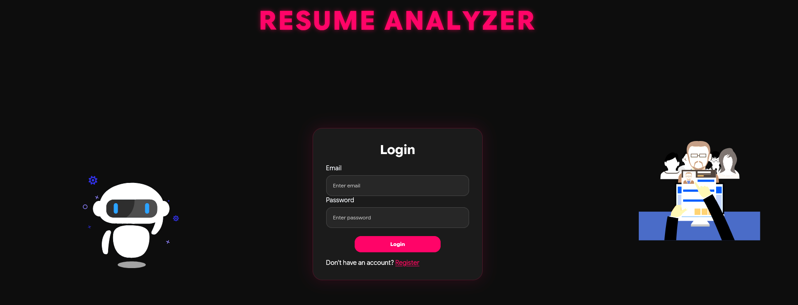
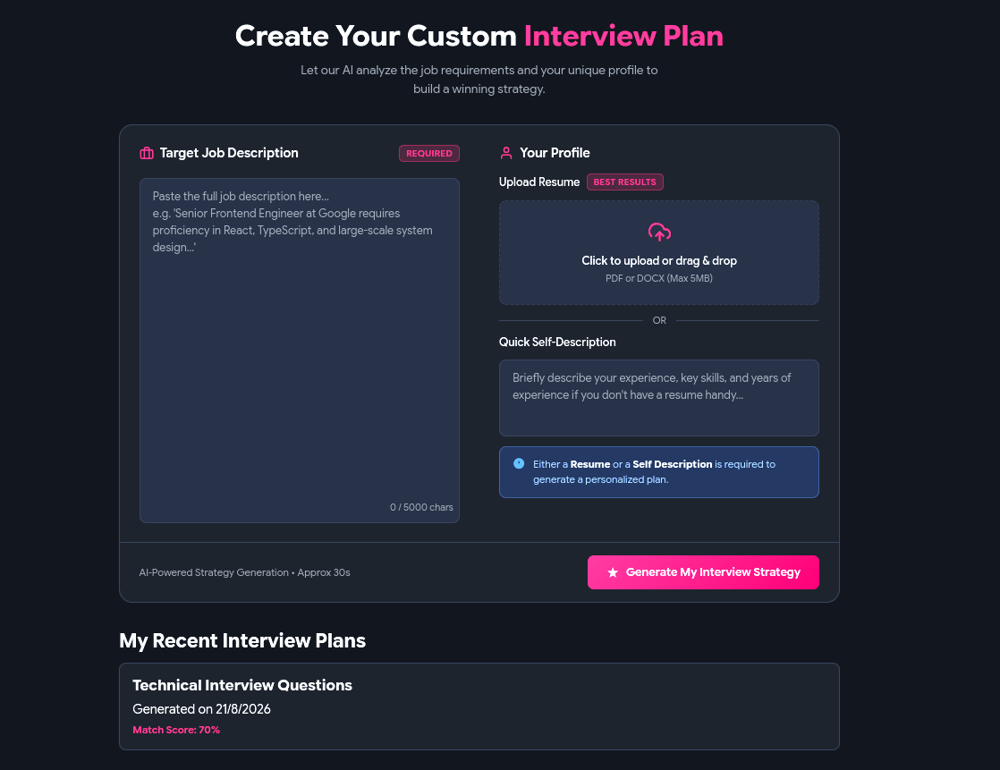
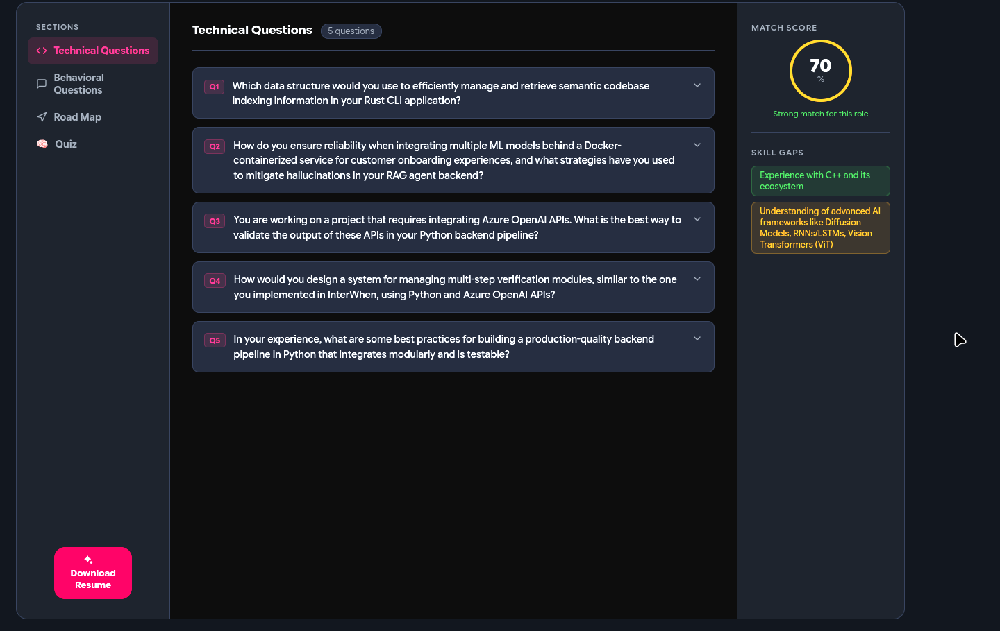

<div align="center">

# 🤖 Resume Analyzer

**AI-powered interview prep — turn a resume and a job description into a personalized interview strategy.**

Upload your resume (or write a quick self-description), paste a target job description, and get back tailored technical & behavioral questions, a match score, skill-gap analysis, a day-by-day prep roadmap, and a self-test quiz — all generated by a local LLM.

</div>

---

## 📸 Screenshots

<table>
<tr>
<td width="33%">

**Login**



</td>
<td width="33%">

**Create an interview plan**



</td>
<td width="33%">

**Generated technical questions**



</td>
</tr>
</table>

---

## ✨ Features

- **Auth** — register/login with JWT-based sessions (httpOnly cookies), backed by MongoDB
- **Resume upload** — accepts PDF or DOCX (max 5MB), parsed server-side into plain text
- **AI-generated interview report**, tailored to your resume/profile and the target job description:
  - **Match score** (0–100) with a short verdict ("Strong match for this role")
  - **5 technical questions**, each with the interviewer's intention and a model answer
  - **5 behavioral questions**, same structure
  - **Skill gaps**, flagged by severity (low/medium/high)
  - **Day-by-day preparation roadmap**
  - **5-question self-test quiz** to check your own answers before the real interview
- **Downloadable resume PDF** — the AI drafts a clean, ATS-friendly HTML resume and renders it to PDF via Puppeteer
- **Report history** — past interview plans are saved per-user and listed on the home page

---

## 🛠️ Tech Stack

**Frontend** — `Frontend/`
- React 19 + Vite
- React Router
- Framer Motion (animations) + Lottie (illustrations)
- Sass
- Axios

**Backend** — `Backend/`
- Node.js + Express 5
- MongoDB + Mongoose
- JWT auth (`jsonwebtoken`) + `bcryptjs` for password hashing
- Multer (file upload handling, in-memory)
- `pdf-parse` (PDF text extraction) + `mammoth` (DOCX text extraction)
- Zod (schema validation for AI output)
- Puppeteer (HTML → PDF rendering)
- **Ollama**, running a local `qwen2.5:3b` model — powers all AI generation (report, quiz, resume PDF). No OpenAI/Gemini API calls are made at runtime, even though those SDKs are listed as dependencies.

---

## 📁 Project Structure

```
RESUME-ANALYZER/
├── Backend/
│   ├── server.js                # entry point — starts Express on :3000
│   └── src/
│       ├── app.js               # Express app, middleware, error handler
│       ├── config/database.js   # MongoDB connection
│       ├── controllers/         # auth + interview business logic
│       ├── middlewares/         # JWT auth guard, multer file upload
│       ├── models/              # User, InterviewReport, Blacklist (Mongoose)
│       ├── routes/               # /api/auth, /api/interview
│       └── services/ai.service.js  # prompts Ollama, validates/normalizes AI output
├── Frontend/
│   └── src/
│       ├── features/
│       │   ├── auth/            # Login, Register, useAuth hook, auth API client
│       │   └── interview/       # Home (create plan), Interview (report view), Quiz
│       └── ...
├── docs/screenshots/            # README images
└── HOW_TO_RUN.md                # detailed local setup & run instructions
```

---

## 🔌 API Overview

All interview routes require an authenticated session (JWT cookie).

| Method | Route | Description |
|---|---|---|
| `POST` | `/api/auth/register` | Create an account |
| `POST` | `/api/auth/login` | Log in, sets auth cookie |
| `GET` | `/api/auth/logout` | Log out |
| `GET` | `/api/auth/get-me` | Get the current logged-in user |
| `POST` | `/api/interview/` | Upload resume + descriptions, generate a new interview report |
| `GET` | `/api/interview/` | List all interview reports for the logged-in user |
| `GET` | `/api/interview/report/:interviewId` | Get a single report by ID |
| `GET` | `/api/interview/resume/:interviewReportId` | Generate & download an AI-drafted resume PDF |

---

## 🚀 Getting Started

Quick version:

```bash
# Backend
cd Backend
npm install
cp .env.example .env   # fill in MONGO_URI and JWT_SECRET
npm run dev             # runs on http://localhost:3000

# Frontend (new terminal)
cd Frontend
npm install
npm run dev              # runs on http://localhost:5173
```

You'll also need **MongoDB** running and **[Ollama](https://ollama.com)** running locally with the `qwen2.5:3b` model pulled (`ollama pull qwen2.5:3b`) — the app can't generate anything without it.

👉 **See [HOW_TO_RUN.md](./HOW_TO_RUN.md) for full setup details, environment variables, and troubleshooting.**

---

## 📄 License

No license file is currently included in this repository — all rights reserved by the author unless stated otherwise.
